# From Edges to Objects: Detecting Shapes and Structures with OpenCV

This blog, though not the most complex, shows a variety of some of the most useful image manipulation techniques that are commonly used today, especially as it relates to edge detection and image pre-processing.

### Imports & Sample Images

```
import cv2
import numpy as np
import urllib.request
import matplotlib.pyplot as plt
import base64

from IPython.display import HTML, display
from io import BytesIO
from PIL import Image
```

```
# Collecting the sample image
image_url = "https://raw.githubusercontent.com/SoftwareSushi/marketing-resources/main/images/opencv_blog/part_5/Parrot_underwater.png"
resp = urllib.request.urlopen(image_url)
image_bytes = np.asarray(bytearray(resp.read()), dtype=np.uint8)

image_url_2 = "https://raw.githubusercontent.com/SoftwareSushi/marketing-resources/main/images/opencv_blog/part_5/Parrots_contours.png"
resp_2 = urllib.request.urlopen(image_url_2)
image_bytes_2 = np.asarray(bytearray(resp_2.read()), dtype=np.uint8)
```

### Utils

```
# Function for the creation of flexible MatPlotLib figures
def create_mpl_figure(w,h,images,titles="Image",axis="off",color_maps=None):
    plt.figure(figsize=[w,h])

    for i, image in enumerate(images):
        plt.subplot(1,len(images),i+1);

        if color_maps is None:
            plt.imshow(image);
        elif len(color_maps) > 1:
            plt.imshow(image, cmap=f"{color_maps[i]}");
        else:
            plt.imshow(image, cmap=f"{color_maps[0]}")

        plt.title(titles[i]);
        plt.axis(axis);

def display_image_gallery(
    images, titles=None, img_width=200, fmt="png"
):
    if titles is None:
        titles = [''] * len(images)
    if len(images) != len(titles):
        raise ValueError("`images` and `titles` must be the same length.")

    def to_pil(arr):
        if isinstance(arr, Image.Image):
            return arr
        if arr.dtype != np.uint8:
            arr = np.clip(arr, 0, 255).astype("uint8")
        if arr.ndim == 2:
            return Image.fromarray(arr, mode="L")
        if arr.shape[2] == 3:
            return Image.fromarray(arr, mode="RGB")
        if arr.shape[2] == 4:
            return Image.fromarray(arr, mode="RGBA")
        raise ValueError("Unsupported array shape.")

    blocks = []
    for img, cap in zip(images, titles):
        pil = to_pil(img)
        buf = BytesIO(); pil.save(buf, format=fmt.upper())
        data_uri = f"data:image/{fmt};base64,{base64.b64encode(buf.getvalue()).decode()}"
        wstyle = f"width:{img_width}px;" if img_width is not None else ""
        blocks.append(f"""
          <figure style="display:flex;flex-direction:column;align-items:center;margin:0;">
             <figcaption style="color:#000;font:14px/1.2 sans-serif;margin:0 0 4px 0;">
                {cap}
             </figcaption>
             
          </figure>
        """)

    html = f"""
    <div style="
         display:inline-flex;
         gap:10px;
         padding:10px;
         background:#fff;
         border-radius:4px;">
        {''.join(blocks)}
    </div>
    """
    display(HTML(html))
```

## List of Techniques

- Sobel Edge Detection
- Laplacian Edge Detection
- Canny Edge Detection
- Contour Detection
- Dilation
- Erosion
- Opening
- Closing
- Morphological Gradient
- Top Hat
- Black Hat

## Use Cases

All of the techniques covered in this blog all have a wide variety of different applications. From lane keeping assist systems and steering control systems, to different pre-processing steps, or to pupil isolation while at the eye doctor, each of these techniques has many different ways it is useful to us.

## Techniques

### Sobel Edge Detection

**What it does:** Sobel Edge Detection uses the sobel operator, which is a first-order derivative that evaluates the _rate_ of the change from one pixel to another. These areas of significant change, are identified as edges.

**Why it matters:** Sobel Edge Detection is a rather common technique used in Lane Keeping Assistance systems, as well as in the live autofocus process of phone cameras.

**The Code & Output**

```
# Reading the sample image
bgr_img = cv2.imdecode(image_bytes, cv2.IMREAD_COLOR)
img = cv2.cvtColor(bgr_img, cv2.COLOR_BGR2RGB)

# Image pre-processing
# Conversion to grayscale
gray_img = cv2.imdecode(image_bytes, cv2.IMREAD_GRAYSCALE)

# Sobel Edge Detection
# X axis edge detection
sobel_x = cv2.Sobel(src=gray_img, ddepth=cv2.CV_64F, dx=1, dy=0, ksize=5)
# Y Axis edge detection
sobel_y = cv2.Sobel(src=gray_img, ddepth=cv2.CV_64F, dx=0, dy=1, ksize=5)
# Combined X,Y edge detection
sobel_xy = cv2.Sobel(src=gray_img, ddepth=cv2.CV_64F, dx=1, dy=1, ksize=7)

# Creation of an HTML gallery to display image outputs
display_image_gallery([img, sobel_x, sobel_y, sobel_xy], ["Original", "X Axis Edge Detection", "Y Axis Edge Detection", "Combined Edge Detection"], 400, "png")
```

<div style="display: flex; justify-content: space-around;">
    <div>
        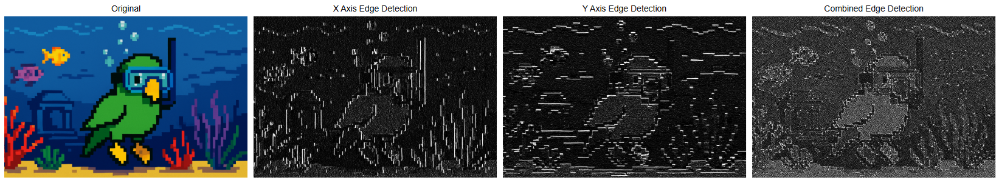
    </div>
</div>

### Laplacian Edge Detection

**What it does:** Laplacian Edge Detection uses the laplacian operator, which is a second-order derivative that evaluates the _nature_ of the change from one pixel to another, whether that change be positive or negative. Also useful in edge detection like the sobel operator before it, but in this case, the laplacian operator is direction agnostic, meaning it detects edges in any direction, not just the x & y axes like the sobel operator.

**Why it matters:** Laplacian Edge Detection is commonly used in the detection of defects in the manufacturing of printed circuit boards, as well as in the detection of cracks in paintings.

**The Code & Output**

```
# Reading the sample image
bgr_img = cv2.imdecode(image_bytes, cv2.IMREAD_COLOR)
img = cv2.cvtColor(bgr_img, cv2.COLOR_BGR2RGB)

# Image pre-processing
# Convert to grayscale
gray_img = cv2.imdecode(image_bytes, cv2.IMREAD_GRAYSCALE)

# Laplacian Edge Detection
laplacian = cv2.Laplacian(src=gray_img, ddepth=cv2.CV_64F, ksize=1)

laplacian_abs = cv2.convertScaleAbs(laplacian)

# Creation of an HTML gallery to display image outputs
display_image_gallery([img, laplacian_abs], ["Original", "Laplacian Edge Detection"], 400, "png")
```

<div style="display: flex; justify-content: space-around;">
    <div>
        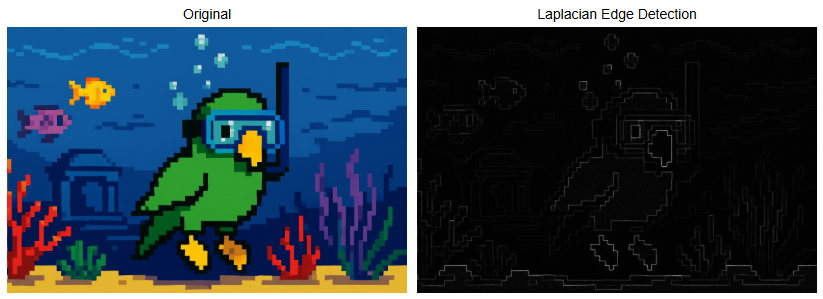
    </div>
</div>

### Canny Edge Detection

**What it does:** Canny Edge Detection is a four step pipeline that is very effective for edge detection. The steps are as follows: Gaussian blur for noise reduction, sobel gradients, non-max suppression for thinning edges, and double-threshold hysteresis to link weak to strong edges. This technique is one of the most popular edge detection techniques because of how reliable and flexible it is.

**Why it matters:** Canny Edge Detection is commonly used in mobile document scanners, as well as in face scanning in a webcam to determine what part of an image is a probable face when blurring the background vs the foreground.

**The Code & Output**

```
# Reading the sample image
bgr_img = cv2.imdecode(image_bytes, cv2.IMREAD_COLOR)
img = cv2.cvtColor(bgr_img, cv2.COLOR_BGR2RGB)

# Image pre-processing
# Conversion to grayscale
gray_img = cv2.imdecode(image_bytes, cv2.IMREAD_GRAYSCALE)

# Canny Edge Detection
# Noise Reduction
blur = cv2.GaussianBlur(gray_img, (5, 5), 1.4)

# Canny Edge Detection
edge_detection = cv2.Canny(blur, threshold1=100, threshold2=200)

# Creation of an HTML gallery to display image outputs
display_image_gallery([img, edge_detection], ["Original", "Canny Edge Detection"], 400, "png")
```

<div style="display: flex; justify-content: space-around;">
    <div>
        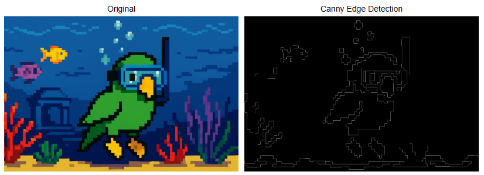
    </div>
</div>

### Contour Detection

**What it does:** Countour detection detects the borders of objects within an image.

**Why it matters:** Countour detection is very often one of the pre-processing steps for many different image manipulation techniques. We even saw it applied while demonstrating the watershed algorithm in the last blog. It is used in commonly in motion detection, in background and foreground segmentation (think grabcut algorithm), as well as in blister pack pill counting, for instance.

**The Code & Output**

```
# Reading the sample image
bgr_img = cv2.imdecode(image_bytes_2, cv2.IMREAD_COLOR)
img = cv2.cvtColor(bgr_img, cv2.COLOR_BGR2RGB)

# Image pre-processing
# Conversion to grayscale
gray_img = cv2.imdecode(image_bytes_2, cv2.IMREAD_GRAYSCALE)

# Thresholding
ret, thresh = cv2.threshold(gray_img, 70, 255, cv2.THRESH_BINARY)

# Countour Detection
contours, hierarchy = cv2.findContours(image=thresh, mode=cv2.RETR_TREE, method=cv2.CHAIN_APPROX_SIMPLE)

img_copy = img.copy()
cv2.drawContours(image=img_copy, contours=contours, contourIdx=-1, color=(255, 0, 0), thickness=2, lineType=cv2.LINE_AA)

# Creation of an HTML gallery to display image outputs
display_image_gallery([img, img_copy], ["Original", "Countour Detection"], 400, "png")
```

<div style="display: flex; justify-content: space-around;">
    <div>
        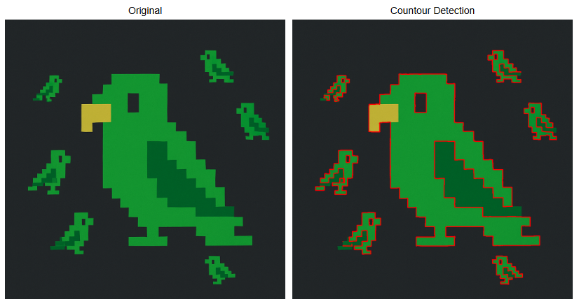
    </div>
</div>

### Dilation

**What it does:** Dilation increases the area of the objects within a given image. It is one of the two foundational morphological operations.

**Why it matters:** Dilation is commonly used in instances like lane-paint bridging, where dashed lane lines are dilated into long, continuous road lines to be fed to steering assistance / control. It is also used for the creation of heatmaps.

**The Code & Output**

```
# Reading the sample image
bgr_img = cv2.imdecode(image_bytes, cv2.IMREAD_COLOR)
img = cv2.cvtColor(bgr_img, cv2.COLOR_BGR2RGB)

# Dilation
kernel = np.ones((5, 5), np.uint8)

dilation = cv2.dilate(img, kernel, iterations=3)

# Creation of an HTML gallery to display image outputs
display_image_gallery([img, dilation], ["Original", "Dilation"], 400, "png")
```

<div style="display: flex; justify-content: space-around;">
    <div>
        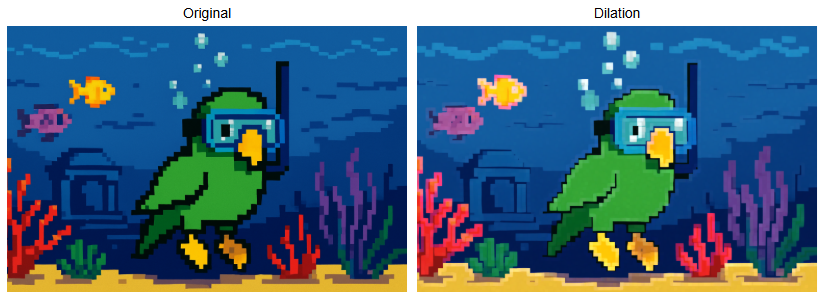
    </div>
</div>

### Erosion

**What it does:** Erosion, as the name implies, erodes the boundaries of the foreground object within a given image. It is one of the two foundational morphological operations.

**Why it matters:** Erosion is useful for image pre-processing, specifically in the removal of salt and pepper noise, or in the creation of sure foreground during implementation of the watershed algorithm.

**The Code & Output**

```
# Reading the sample image
bgr_img = cv2.imdecode(image_bytes, cv2.IMREAD_COLOR)
img = cv2.cvtColor(bgr_img, cv2.COLOR_BGR2RGB)

# Erosion
kernel = np.ones((5, 5), np.uint8)

erosion = cv2.erode(img, kernel, iterations=3)

# Creation of an HTML gallery to display image outputs
display_image_gallery([img, erosion], ["Original", "Erosion"], 400, "png")
```

<div style="display: flex; justify-content: space-around;">
    <div>
        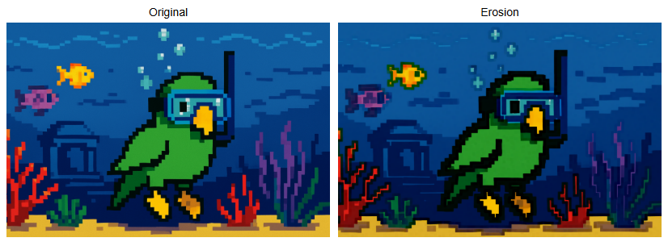
    </div>
</div>

### Opening

**What it does:** Opening is a morphological operation. It is the process of erosion followed by dilation.

**Why it matters:** Opening is typically used for the removal of noise in an image, specifically "salt" noise (isolated bright pixels). It is also good for smoothing object contours without growing them.

**The Code & Output**

```
# Reading the sample image
bgr_img = cv2.imdecode(image_bytes, cv2.IMREAD_COLOR)
img = cv2.cvtColor(bgr_img, cv2.COLOR_BGR2RGB)

# Opening
kernel = np.ones((5, 5), np.uint8)

opening = cv2.morphologyEx(img, cv2.MORPH_OPEN, kernel, iterations=10)

# Creation of an HTML gallery to display image outputs
display_image_gallery([img, opening], ["Original", "Opening"], 400, "png")
```

<div style="display: flex; justify-content: space-around;">
    <div>
        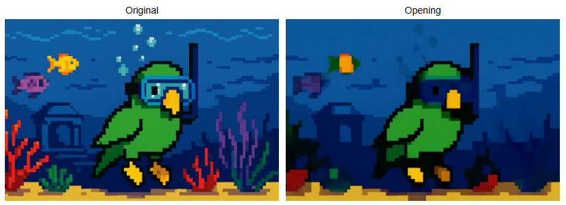
    </div>
</div>

### Closing

**What it does:** Closing is is a morphological operation. It is the process of dilation followed by erosion.

**Why it matters:** Closing is primarily used for removal of noise, particularly "pepper" noise (isolated dark pixels). It can also be used for closing breaks and cracks within the image.

**The Code & Output**

```
# Reading the sample image
bgr_img = cv2.imdecode(image_bytes, cv2.IMREAD_COLOR)
img = cv2.cvtColor(bgr_img, cv2.COLOR_BGR2RGB)

# Closing
kernel = np.ones((5, 5), np.uint8)

closing = cv2.morphologyEx(img, cv2.MORPH_CLOSE, kernel, iterations=10)

# Creation of an HTML gallery to display image outputs
display_image_gallery([img, closing], ["Original", "Closing"], 400, "png")
```

<div style="display: flex; justify-content: space-around;">
    <div>
        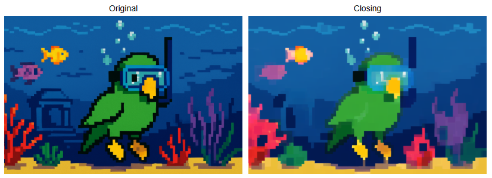
    </div>
</div>

### Morphological Gradient

**What it does:** Morphological Gradient is a morphological operation that takes an original image, erodes it, then takes the same orignal image, dilates it, and then computes the difference between the eroded and dilated image. The output will then be the outlined difference between the two images.

**Why it matters:** Morphological Gradient is useful for a variety of different things. It can often help with document layour analysis for scanned documents, package seal integrity checking for food safety, or enabling mobile devices to screen users for diabetic retinopathy.

**The Code & Output**

```
# Reading the sample image
bgr_img = cv2.imdecode(image_bytes, cv2.IMREAD_COLOR)
img = cv2.cvtColor(bgr_img, cv2.COLOR_BGR2RGB)

# Morphological Gradient
kernel = np.ones((5, 5), np.uint8)

morph_gradient = cv2.morphologyEx(img, cv2.MORPH_GRADIENT, kernel)

# Creation of an HTML gallery to display image outputs
display_image_gallery([img, morph_gradient], ["Original", "Morphological Gradient"], 400, "png")
```

<div style="display: flex; justify-content: space-around;">
    <div>
        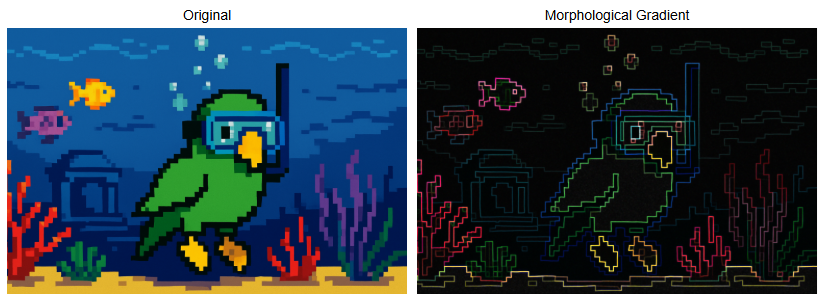
    </div>
</div>

### Top Hat

**What it does:** Top Hat is a morphological operation which outputs the difference between an image that is opened from the original image itself, isolating bright features on a dark or uneven background.

**Why it matters:** Top Hat can be used to detect specular defects on LCDs, as well as reliably binarizing license plates even while under siginificant glare from headlights.

**The Code & Output**

```
# Reading the sample image
bgr_img = cv2.imdecode(image_bytes, cv2.IMREAD_COLOR)
img = cv2.cvtColor(bgr_img, cv2.COLOR_BGR2RGB)

# Image pre-processing
# Conversion to grayscale
gray_img = cv2.imdecode(image_bytes, cv2.IMREAD_GRAYSCALE)

# Thresholding
ret, thresh = cv2.threshold(gray_img, 127, 255, cv2.THRESH_BINARY + cv2.THRESH_OTSU)

# Top Hat
kernel = np.ones((49, 49), np.uint8)

top_hat = cv2.morphologyEx(thresh, cv2.MORPH_TOPHAT, kernel)

# Creation of an HTML gallery to display image outputs
display_image_gallery([gray_img, top_hat], ["Original", "Top Hat"], 400, "png")
```

<div style="display: flex; justify-content: space-around;">
    <div>
        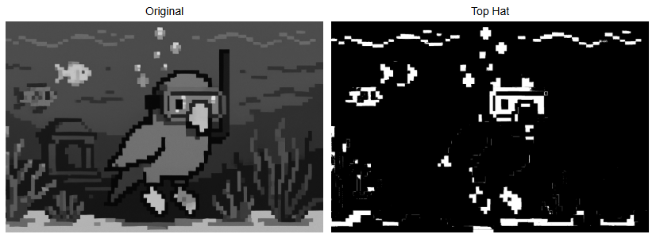
    </div>
</div>

### Black Hat

**What it does:** Black Hat takes the original form of an image and subtracts it from the closing of that same image, isolating small dark features on a bright background.

**Why it matters:** Black Hat can be used for detection of cracks in concrete, pupil isolation under bright light at the ophthalmologist, or for currency validation to guard against counterfeiting.

**The Code & Output**

```
# Reading the sample image
bgr_img = cv2.imdecode(image_bytes, cv2.IMREAD_COLOR)
img = cv2.cvtColor(bgr_img, cv2.COLOR_BGR2RGB)

# Image pre-processing
# Conversion to grayscale
gray_img = cv2.imdecode(image_bytes, cv2.IMREAD_GRAYSCALE)

# Thresholding & Inversion
ret, thresh = cv2.threshold(gray_img, 127, 255, cv2.THRESH_BINARY + cv2.THRESH_OTSU)

# Top Hat
kernel = np.ones((49, 49), np.uint8)

black_hat = cv2.morphologyEx(thresh, cv2.MORPH_BLACKHAT, kernel)

# Creation of an HTML gallery to display image outputs
display_image_gallery([gray_img, black_hat], ["Original", "Black Hat"], 400, "png")
```

<div style="display: flex; justify-content: space-around;">
    <div>
        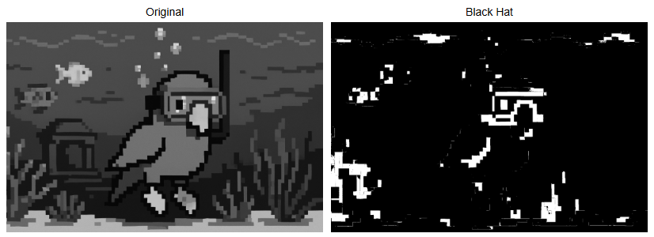
    </div>
</div>

## Conclusion

Our next and final blog will be covering common pattern recognition and feature extraction techniques. I hope you enjoyed this blog and learned some things from it that you can put into practice in whatever projects you find yourself working on.
