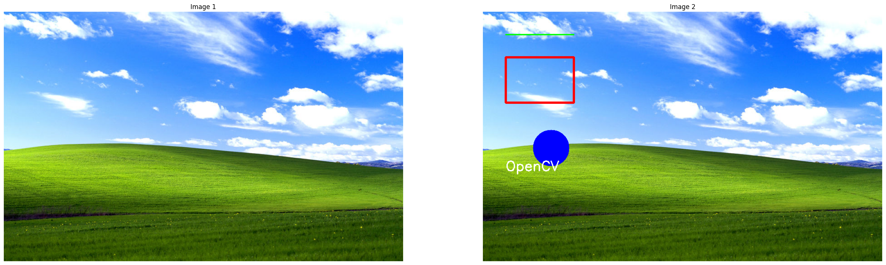
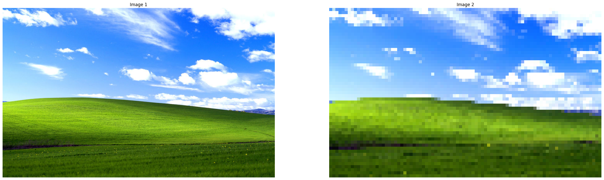
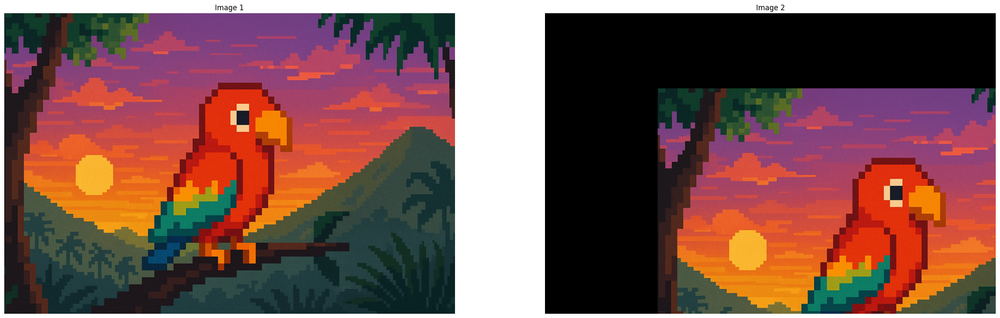
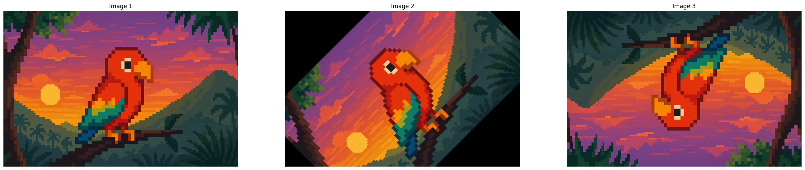
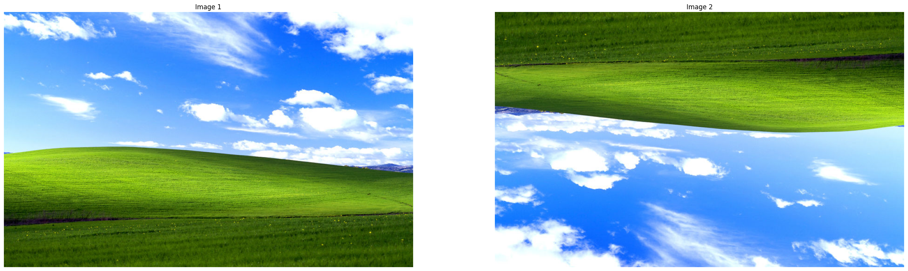
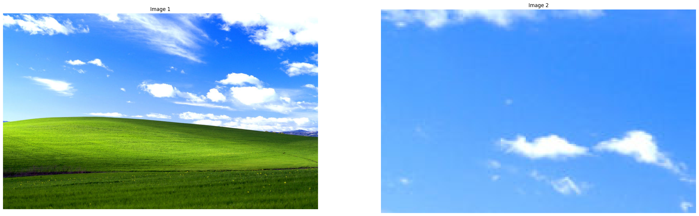
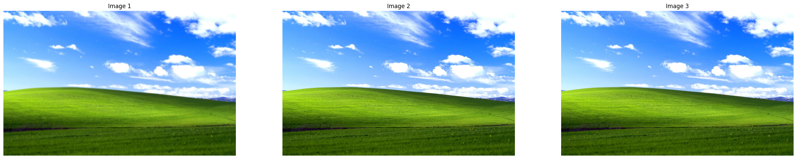

# Fundamentals of Image Manipulation with OpenCV

OpenCV is the most common library for utilizing computer vision. In this first, we will be covering the foundational image manipulation techniques found within OpenCV that will both enable basic image manipulation, as well as serve as components of more advanced techniques that will be covered in later blogs within this series.

### Imports & Sample Images

```
import cv2
import numpy as np
import urllib.request
import matplotlib.pyplot as plt

from google.colab.patches import cv2_imshow
```

```
# Collecting the sample image
image_url = "https://raw.githubusercontent.com/SoftwareSushi/marketing-resources/main/images/Windows%20XP%20Background.jpg"
resp = urllib.request.urlopen(image_url)
image_bytes = np.asarray(bytearray(resp.read()), dtype=np.uint8)
```

### Utils

```
def create_mpl_figure(w,h,images):
    plt.figure(figsize=[w,h])
    for i, image in enumerate(images):
        plt.subplot(1,len(images),i+1); plt.imshow(image); plt.title(f'Image {i+1}'); plt.axis('off');
```

## List of Techniques

- Draw rectangle
- Draw circle
- Draw text
- Resizing
- Translation
- Rotation
- Horizontal Flipping
- Vertical Flipping
- Cropping / Zooming
- Image Pyramids

## Use Cases

In this blog, we will be covering a variety of basic image manipulation techniques, all of which have a number of very useful implementations. Whether it be using rectangels, circles, resizing or cropping in order to track objects in images or videos, or using a combination of cropping, rotation, flipping in order to train a machine learning model to better recognize a given subject, each of these techniques has a variety of different real world applications which makes them useful.

## Techniques

### Drawing on Images:

**What it does:** Adds visual elements (shapes and text) to an image

**Why it matters:** Drawing on images is useful for annotation, visualization, or debugging during processing.

**The Code & Output**

```
# Reading the sample image
bgr_image = cv2.imdecode(image_bytes, cv2.IMREAD_COLOR)

# Color conversion to ensure proper display of images
image = cv2.cvtColor(bgr_image, cv2.COLOR_BGR2RGB)
image_edit = cv2.cvtColor(bgr_image, cv2.COLOR_BGR2RGB)

# Image Transformations
cv2.line(image_edit, (50, 50), (200, 50), (0, 255, 0), 2)
cv2.rectangle(image_edit, (50, 100), (200, 200), (255, 0, 0), 3)
cv2.circle(image_edit, (150, 300), 40, (0, 0, 255), -1)
cv2.putText(image_edit, "OpenCV", (50, 350), cv2.FONT_HERSHEY_SIMPLEX, 1, (255, 255, 255), 2)

# Creation of the MatPlotLib figure for comparison of images
create_mpl_figure(30,10, [image, image_edit])
```

<div style="display: flex; justify-content: space-around;">
    <div>
        
    </div>
</div>

### Resizing:

**What it does:** Resizing scales an image according to desired size of an image, scale factors fx and fy, and an interpolation method.

**Why it matters:** Resizing, and more broadly image scaling as a whole can be very useful when it comes to image processing in the process of training a machine learning model. By reducing the number of pixels in an image, it can reduce the amount of time spent training for a given model by presenting it with less complex, albeit less accurate training data.

**The Code & Output**

```
# Reading the sample image
bgr_image = cv2.imdecode(image_bytes, cv2.IMREAD_COLOR)

# Color conversion to ensure proper display of images
image = cv2.cvtColor(bgr_image, cv2.COLOR_BGR2RGB)

# Getting the dimensions of the image
height, width = image.shape[:2]

# Creating the resized image
resized_image = cv2.resize(image, (0,0), fx=0.1, fy=0.1, interpolation=cv2.INTER_LINEAR)

# Creation of the MatPlotLib figure for comparison of images
create_mpl_figure(30,10, [image, resized_image])
```

<div style="display: flex; justify-content: space-around;">
    <div>
        
    </div>
</div>

### Translation:

**What it does:** Shifts a given image by a specified number of pixels along the x and y axes. These pixel shifts can be represented by the following notations: tx & ty

**Why it matters:** Image translations are often used for object tracking, image alignment, and augmentation of data used for machine learning.

**The Code & Output**

```
# Reading the sample image
bgr_image = cv2.imdecode(image_bytes, cv2.IMREAD_COLOR)

# Color conversion to ensure proper display of images
image = cv2.cvtColor(bgr_image, cv2.COLOR_BGR2RGB)

# Image Translation
# Getting the dimensions of the image
height, width = image.shape[:2]

# Create translation values
tx, ty = width / 4, height / 4

# Create translation matrix
translation_matrix = np.array([
    [1, 0, tx],
    [0, 1, ty]
], dtype=np.float32)

# Apply matrix to image
translated_image = cv2.warpAffine(src=image, M=translation_matrix, dsize=(width, height))

# Creation of the MatPlotLib figure for comparison of images
create_mpl_figure(30,10, [image, translated_image])
```

<div style="display: flex; justify-content: space-around;">
    <div>
        
    </div>
</div>

### Rotation:

**What it does:** Allows users to rotate a given image about a certain point in the image by a specified number of degrees using a rotation matrix, or by the center of the image in 90 degree increments by using the getRotationMatrix2D() & warpAffine() methods or the rotate() method accordingly.

**Why it matters:** Rotation can be used to automate rotation of important physical documents submitted electronically, increasing accuracy of other methods for recognizing text and images on scanned / photographically captured documents.

**The Code & Output**

```
# Reading the sample image
bgr_image = cv2.imdecode(image_bytes, cv2.IMREAD_COLOR)

# Color conversion to ensure proper display of images
image = cv2.cvtColor(bgr_image, cv2.COLOR_BGR2RGB)

# Specific Degree Rotation
# Getting the dimensions of the image and the centerpoint
height, width = image.shape[:2]
center = (width/2, height/2)

# Creating rotation matrix and applying it to the image, retaining the same dimensions
rotate_matrix = cv2.getRotationMatrix2D(center=center, angle=45, scale=1)
rotated_image = cv2.warpAffine(src=image, M=rotate_matrix, dsize=(width, height))

# 90-Degree Increment Rotation
rotated_image_2 = cv2.rotate(image, cv2.ROTATE_180) # Also try ROTATE_90_CLOCKWISE, ROTATE_90_COUNTERCLOCKWISE

# Creation of the MatPlotLib figure for comparison of images
create_mpl_figure(30,10, [image, rotated_image, rotated_image_2])
```

<div style="display: flex; justify-content: space-around;">
    <div>
        
    </div>
</div>

### Flipping:

**What it does:** Flips a given image about either the x axis, the y axis, or the x and y axis using the according flip codes 0, 1, and -1.

**Why it matters:** Flipping images can create more reliable machine learning models by providing them with new data samples of existing data on which they have been trained. It can be also used to correct orientation of camera feeds for surveillance purposes, among many other uses.

**The Code & Output**

```
# Reading the sample image
bgr_image = cv2.imdecode(image_bytes, cv2.IMREAD_COLOR)

# Color conversion to ensure proper display of images
image = cv2.cvtColor(bgr_image, cv2.COLOR_BGR2RGB)

# Flipping the sample image
flipped_image = cv2.flip(image, -1)

# Creation of the MatPlotLib figure for comparison of images
create_mpl_figure(30,10, [image, flipped_image])
```

<div style="display: flex; justify-content: space-around;">
    <div>
        
    </div>
</div>

### Cropping / Zooming:

**What it does:** Displays a certain section of an image, defined by slicing a given image.

**Why it matters:** Cropping can be very useful for object detection and recognition as a pre-processing step by cropping out the relevant portion of an image, allowing faster and more accurate recognition. Additionally, it can be used as a step of image of segmentation, and other techniques for image analysis.

**The Code & Output**

```
# Reading the sample image
bgr_image = cv2.imdecode(image_bytes, cv2.IMREAD_COLOR)

# Color conversion to ensure proper display of images
image = cv2.cvtColor(bgr_image, cv2.COLOR_BGR2RGB)

# Get image shape (width = 550, height = 880, channel = 3)
print(image.shape)

# Crop image (image[row,column])
cropped_image = image[50:180, 100:300]

# Creation of the MatPlotLib figure for comparison of images
create_mpl_figure(30,10, [image, cropped_image])
```

<div style="display: flex; justify-content: space-around;">
    <div>
        
    </div>
</div>

### Image Pyramids:

**What it does:** Image Pyramids upsample or downsample a given image.

**Why it matters:** Upsampling can be used to make smaller images more visible by making them larger, allowing them to be more accurately processed while increasing their size, whereas downsampling can decrease image sizes, enabling more images to be stored, as well as increasing the performance of image processing.

**The Code & Output**

```
# Reading the sample image
bgr_image = cv2.imdecode(image_bytes, cv2.IMREAD_COLOR)

# Color conversion to ensure proper display of images
image = cv2.cvtColor(bgr_image, cv2.COLOR_BGR2RGB)

# Upscaling and downscaling the image
upscaled_image = cv2.pyrUp(image)
downscaled_image = cv2.pyrDown(image)

# Creation of the MatPlotLib figure for comparison of images
create_mpl_figure(30,10, [downscaled_image, image, upscaled_image])
```

<div style="display: flex; justify-content: space-around;">
    <div>
        
    </div>
</div>

## Conclusion

In the next blog, we will be covering a number of other techniques, ranging from image arithmetic concerning brightness and contrast, as well as bitwise operations.
